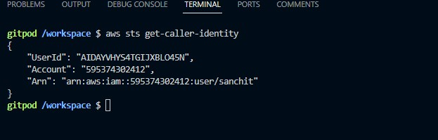
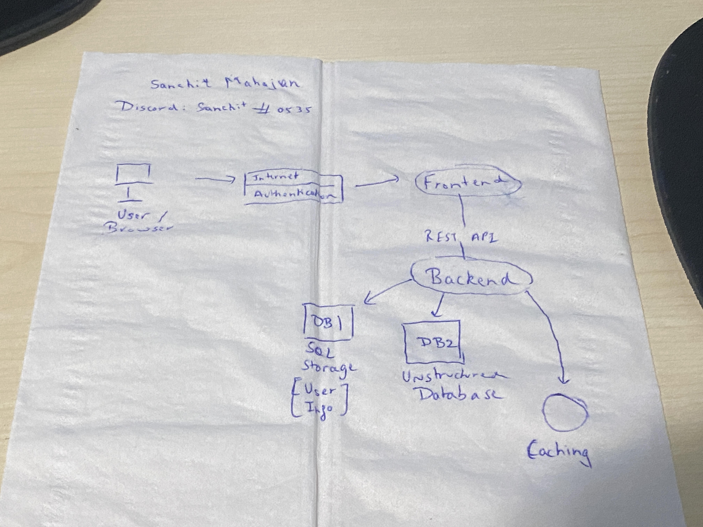
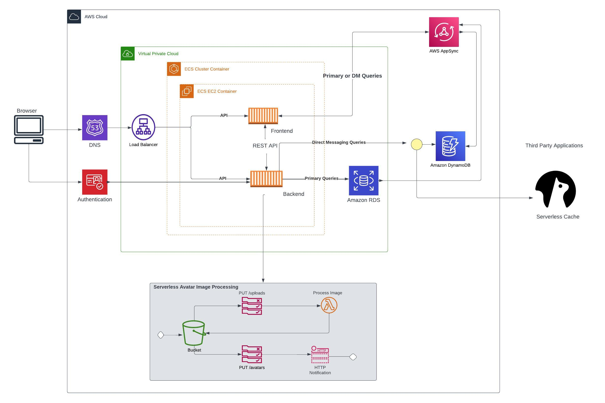
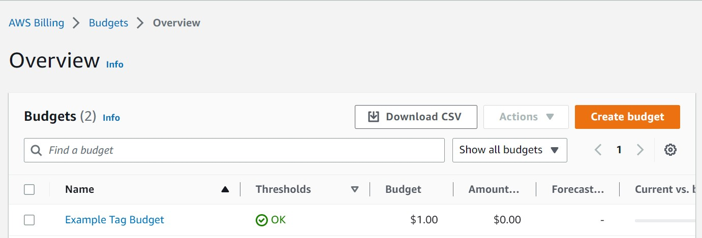
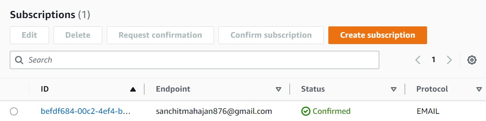
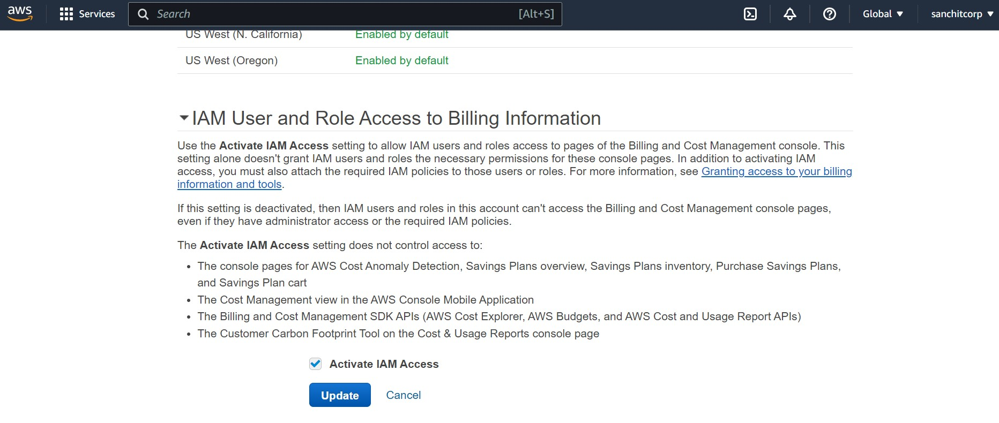
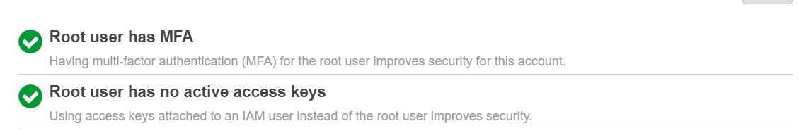
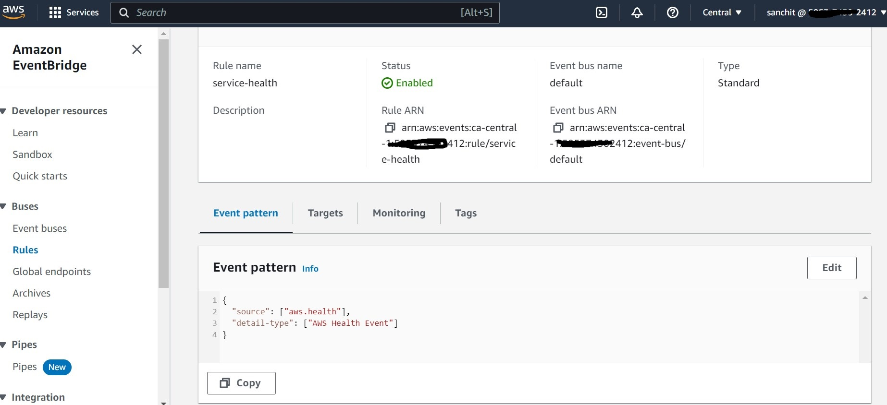
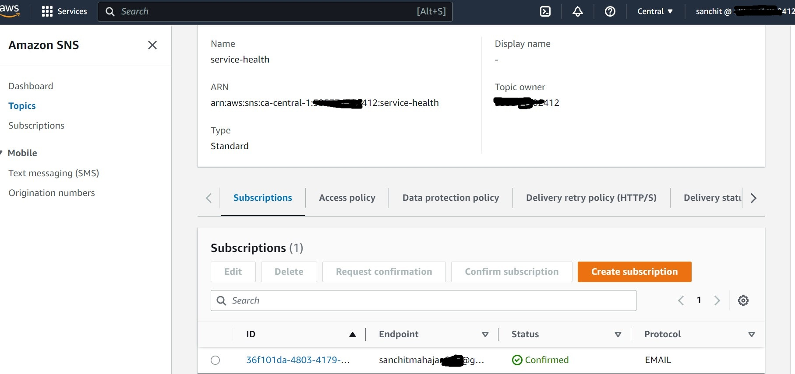

# Week 0 — Billing and Architecture

 The purpose of this week's work was to set up our AWS account with IAM User and configure budget and billing alarms, create conceptual as well as architectural diagrams and get acquainted with CloudShell and Gitpod. This will set us ready for Week 1. 

## Required Homework/Tasks

### Set up AWS Account
 
I created an AWS Account, Set up MFA on the root acoount, and created an IAM User 'sanchit' with administrator privileges.

### Install AWS CLI
I was able to set up Gitpod and set up AWS CLI on it using the steps mentioned in the YouTube video, and generated my Admin users access keys too. and was able to modify gitpod.yml to initialize CLI. Here's the screenshot showing my Account ID set up as env variable:

### Recreate Architectural Diagram

I recreated the conceptual diagram on the napkin as follows:

### Recreate Architectural Diagram

I recreated the architectural diagram using Lucid Charts. Here's the diagram and link to view it:

https://lucid.app/lucidchart/e550b517-acb5-419b-a966-29dc7c222e18/edit?viewport_loc=-2459%2C111%2C4096%2C1852%2C0_0&invitationId=inv_93df9e84-930e-40b9-a339-0e87ef4a8b6e

### CloudShell and Setting up Budget and Billing Alarms

I did some hands-on with CloudShell and set up my budget and Billing alarm via SNS adn EventBridge on Gitpod. The scripts for them are already in my repo, and I'm attaching the screenshots from my console.

Here's the screenshot of the budget:

Here's the screenshot of the SNS topic that has been set up:

## Homework Challenges:

### Destroy Root Credentials, Set MFA, IAM Role

I enabled IAM role on my console when logged in as root to enable IAM users with the specific permissions to view the billing/cost dashboards.

I also made sure the root access keys were disabled and MFA was set up on my AWS console:

### Use EventBridge to hookup Health Dashboard to SNS and send notification when there is a service health issue

I created an Eventbridge rule to check for Service Health and attached an SNS topic called 'service-health' that notifies me through my email.

The SNS topic looks like this:

### Review all the questions of each pillars in the Well Architected Tool (No specialized lens)

I checked all the FAQs and whitepapers on the Well Architected Tool and its pillars like: 
* Operational Excellence Pillar
* Security Pillar
* Reliability Pillar
* Performance Efficiency Pillar
* Cost Optimization Pillar
* Sustainability Pillar

