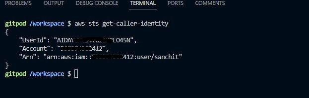

# Week 0 — Billing and Architecture

## Required Homework/Tasks

### Set up AWS Account
 
I created an AWS Account, Set up MFA on the root acoount, and created an IAM User 'sanchit' with administrator privileges.

### Install AWS CLI
I was able to set up Gitpod and set up AWS CLI on it using the steps mentioned in the YouTube video. and was able to modify gitpod.yml to initialize CLI. Here's the screenshot showing my Account ID set up as env variable:

### Recreate Architectural Diagram

I recreated the architectural diagram using Lucid Charts. Here's the diagram and link to view it:

https://lucid.app/lucidchart/e550b517-acb5-419b-a966-29dc7c222e18/edit?viewport_loc=-2459%2C111%2C4096%2C1852%2C0_0&invitationId=inv_93df9e84-930e-40b9-a339-0e87ef4a8b6e

### CloudShell and Setting up Budget and Billing Alarms

I did some hands-on with CloudShell and set up my budget and Billing alarm via SNS adn EventBridge on Gitpod. The scripts for them are already in my repo, and I'm attaching the screenshots from my console.

Here's the screenshot of the budget:

Here's the screenshot of the SNS topic that has been set up:

