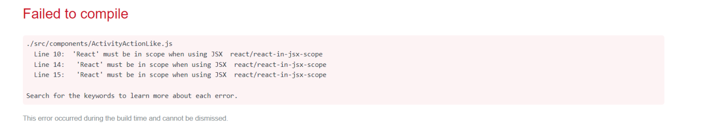

# Week 1 — App Containerization

The purpose of this week's session was to set up containerization for the Cruddur app. We created docker containers, pushed image to Dockerhub, set up the frontend and backend, and enabled the notification feature.

## Created containers for frontend, backend, postgres and dynamodb.
This whole process was smooth, and I learnt alot about Docker containers, especially setting them up and using Docker-compose.yaml and Dockerfile.

## Made sure npm is installed in the frontend directory
I was having some issues initially only to find out I wasn't installing npm in the frontend directory upon restarting the workspace. I then put the commands in the docker-compose.yaml file so that it runs automatically everytime I spin up the workspace.

## Verification of Work completed

The screenshots below should show all the required homework as completed:

## Stretch Homework:

### Run the dockerfile CMD as an external script
This was fairly easy. All I had to do was ask the Dockerfile to run the Python script, and then got the python script to run the commands.

### Push and tag a image to DockerHub
The docker tag is run by tagging the image according to the DockerHub username. I didn't tag it/ use the syntax properly that caused issues while pushing the image, but sorted itself out when I retagged the image.

### Implement a healthcheck in the Docker compose file
I wrote my docker-compose file like this to implement healthcheck on my backend container.

### Install Docker locally and run containers
I was able to Download Docker, sign in and use VSCode on my local machine to pull my docker image and run containers locally.

## Issue I had:
When I set everything up, my front end showed up this error. After several days of diagnosis, it was found that my package.json file had the wrong react version (line 15). Eventually corrected it to 5.0.1 and it worked perfectly!

