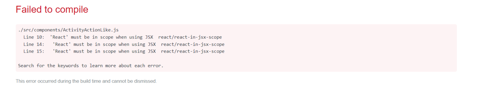

# Week 2 — Distributed Tracing

This week focused on enabling logging, tracing and monitoring for our Cruddur app. Using the following tools and technologies will really help us identify errors and their root cause, assisting in faster resolution.

## Setting up Honeycomb

* Created an account on honeycomb.io and created a new environment 'bootcamp'.
* Generated API Key for the environment and set it as a variable in my Gitpod environment.
 
 
 * We are using Open Source Telemetry (OTEL), and installed the dependencies required by adding the following packages to our requirements.txt file
 
 
 * Added the environment keys in the docker-compose file, and restarted the workspace.
 
 
 * Added the following code to app.py to fully start honeycomb tracing

* Composed up our docker containers to test working and getting our first trace in the Honeycomb dashboard.

## AWS Xray

* Add the required dependencies to requirements.txt

* Add environment variables to the docker-compose file

* Create an xray trace group

* Create a file aws/json/xray.json with the following sampling rule

* Add the following command 

* Add the following to app.py

## AWS CloudWatch

* Add the dependencies in the requirements.txt file

* Add the following to docker-compose file

* Add the following logger command to the app.py file

## Rollbar

* Create an account on Rollbar.

* Add the following dependencies to requirements.txt file:

* Add the following to docker-compose file:

* Add the following to app.py file

* Compose-up the containers to check error on Rollbar:

### Notes
Traditional method logging
New method: Get the whole story of backend where zillions of things happening and what happened through distributed tracing.

Honeycomb is used to get the data through API Keys
Export API keys in the CDE env. (reopen workspace so its properly saved)

Recommended to add the service_name in docker-compose as its specific to a service, and attaching it to the backend service makes more sense.
Whole project needs same API key but diff names for services

span sets
